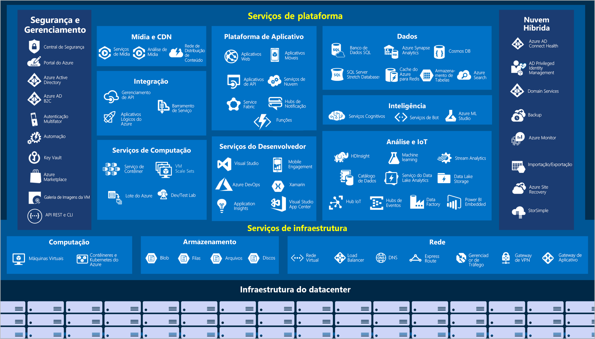

# AZ-900: Fundamentos do Microsoft Azure Curso

Azure é a plataforma de computação em nuvem da Microsoft, os principais
serviços podem ser classificados em:

1. Compute Services (Serviços de computação)
2. Cloud Storage (Armazenamento em nuvem)
3. Networking (Redes)
4. App Hosting (Hospedagem de aplicativos)
5. Artificial Intelligence (Inteligência artificial)
6. Internet of Things (Internet das coisas)
7. Integration (Integrações)
8. Security (Segurança)

## Suas principais caracteristicas são:

    
Alta disponibilidade (Clique para expandir)

Quando um aplicativo, serviço ou qualquer recurso de TI é implantado, eles devem estar disponíveis quando necessário.
A alta disponibilidade se concentra em garantir a disponibilidade máxima, independentemente de interrupções ou eventos que possam ocorrer.

    
Escalabilidade (Clique para expandir)

Outro grande benefício da computação em nuvem é a escalabilidade dos recursos de nuvem. A escalabilidade refere-se à capacidade de ajustar recursos
para atender à demanda. Se experimentarmos um pico repentino de tráfego e seus sistemas ficarem sobrecarregados, a capacidade de escalar significa
que poderá adicionar mais recursos para lidar melhor com o aumento da demanda.
O outro benefício da escalabilidade é não pagar além do necessário pelos serviços. Como a nuvem é um modelo baseado em consumo,
o usuário paga apenas pelo que usa. Se a demanda cair, poderá reduzir seus recursos e, assim, reduzir seus custos.
A escala geralmente vem em duas variedades: vertical e horizontal.

1. A escala vertical se concentra em aumentar ou diminuir a capacidade dos recursos.
2. A escala horizontal é adição ou subtração do número de recursos.

    
Dimensionamento vertical (Clique para expandir)

Com a escala vertical, se um aplicativo precisasse de mais capacidade de processamento, poderia escalar verticalmente, com a alocação de mais CPUs ou
RAM à máquina virtual. Por outro lado, se percebesse que superestimou as necessidades, poderia reduzir verticalmente, diminuindo as especificações
de CPU ou RAM.

    
Dimensionamento horizontal (Clique para expandir)

Com a escala horizontal, se você experimentasse um salto repentino acentuado na demanda, seus recursos implantados poderiam ser expandidos
(automaticamente ou manualmente). Por exemplo, você pode adicionar máquinas virtuais ou contêineres por meio da expansão. Da mesma forma, se houver
uma queda significativa na demanda, os recursos implantados poderão ser reduzidos horizontalmente (de maneira automática ou manual).

    
Confiabilidade (Clique para expandir)

Resiliência é a capacidade que um sistema tem de se recuperar de falhas e continuar funcionando. Devido ao design descentralizado, a nuvem naturalmente
dá suporte a uma infraestrutura confiável e resiliente. Com um design descentralizado, a nuvem permite que você tenha recursos implantados em várias
regiões do mundo. Com essa escala global, mesmo que ocorra um evento catastrófico em uma região, as outras regiões ainda estarão em funcionamento.
Você pode criar aplicativos para aproveitar automaticamente essa confiabilidade maior. Em alguns casos, o próprio ambiente de nuvem mudará
automaticamente para uma região diferente, sem que você precise realizar nenhuma ação.

    
Previsibilidade (Clique para expandir)

A previsibilidade na nuvem permite que você avance com confiança. A previsibilidade pode se concentrar na previsibilidade de desempenho ou na
previsibilidade de custo.

    
Desempenho (Clique para expandir)

A previsibilidade de desempenho se concentra em prever os recursos necessários para oferecer uma experiência positiva aos clientes. O dimensionamento
automático, o balanceamento de carga e a alta disponibilidade são apenas alguns dos conceitos de nuvem que dão suporte à previsibilidade de desempenho.
Se de repente você precisar de mais recursos, o dimensionamento automático poderá implantar recursos adicionais para atender à demanda e depois reduzir
a implantação quando a demanda cair. Ou se o tráfego estiver bem concentrado em uma área, o balanceamento de carga ajudará a redirecionar parte da
sobrecarga para áreas menos sobrecarregadas.

    
Custo (Clique para expandir)

A previsibilidade de custos se concentra em prever o custo dos gastos com a nuvem. Ela permite acompanhar o uso de recursos em tempo real,
monitorar os recursos para garantir a maior eficiência de uso possível e aplicar a análise de dados para encontrar padrões e tendências que ajudam a
planejar melhor as implantações de recursos. Operando na nuvem e usando a análise e as informações da nuvem, é possível prever custos futuros e
ajustar os recursos conforme o necessário.

    
Segurança, Governança e Conformidade (Clique para expandir)

Modelos de conjunto ajudam a garantir que todos os seus recursos implantados atendam aos padrões corporativos e aos requisitos regulatórios
governamentais. Além disso, é possível atualizar todos os seus recursos implantados com novos padrões à medida que os padrões são alterados.
A auditoria baseada em nuvem ajuda a sinalizar qualquer recurso que esteja fora de conformidade com seus padrões corporativos e fornece estratégias
de mitigação. Dependendo do modelo operacional, patches de software e atualizações também podem ser aplicados automaticamente, o que ajuda na
governança e na segurança.
Em relação à segurança, você pode encontrar uma solução de nuvem que atenda às suas necessidades de segurança. Se você quiser o controle máximo da
segurança, a infraestrutura como serviço fornecerá recursos físicos, mas permitirá que você gerencie os sistemas operacionais e o software instalado,
incluindo aplicação de patches e manutenção. Se você quiser que a aplicação de patches e a manutenção sejam tratadas automaticamente, as implantações
de plataforma como serviço ou software como serviço podem ser as melhores estratégias de nuvem para você.
E como a nuvem se destina a uma entrega de recursos de TI via Internet, os provedores de nuvem normalmente são adequados para lidar com situações como
ataques de DDoS (negação de serviço distribuído), tornando sua rede mais robusta e segura.

    
Gerenciamento **da** nuvem (Clique para expandir)

1. Escalar automaticamente a implantação de recursos com base na necessidade.
2. Implantar recursos com base em um modelo pré-configurado, removendo a necessidade de configuração manual.
3. Monitorar a integridade dos recursos e substituir automaticamente os recursos com falha.
4. Receber alertas automáticos com base em métricas configuradas, de modo a ficar ciente do desempenho em tempo real.

    
Gerenciamento **na** nuvem (Clique para expandir)

1. Por meio de um portal da Web.
2. Usando uma interface de linha de comando.
3. Usando APIs.
4. Usando o PowerShell.

## [Principais Caracteristicas do Azure[Neste mesmo curso]](azure/README.md)
Panorama Geral dos Serviços do Azure:

## [IaaS, PaaS, SaaS [Neste mesmo curso]](iaas_paas_saas.md)
## [Certificações Disponíveis [Neste mesmo curso]](certificacoes/README.md)

