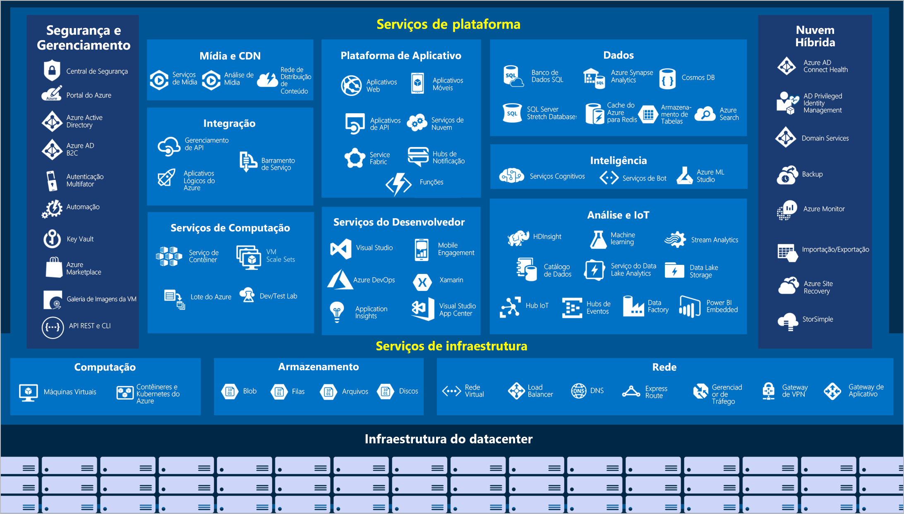

### [Voltar [Neste mesmo curso]](../README.MD)
# Azure
## Principais Caracteristicas
Panorama Geral dos Serviços do Azure:

    
Computação (Clique para expandir)

Serviços de computação são muitas vezes um dos principais motivos pelos quais as empresas mudam para a plataforma do Azure.
Exemplos:
1. Máquinas Virtuais do Azure: VMs (máquinas virtuais) do Windows ou do Linux hospedadas no Azure.
2. Conjuntos de Dimensionamento de Máquinas Virtuais do Azure: Escala para VMs do Windows ou do Linux hospedadas no Azure.
3. Serviço de Kubernetes do Azure: Gerenciamento de clusters para VMs que executam serviços em contêineres.
4. Azure Service Fabric: Plataforma de sistemas distribuídos executada no Azure ou localmente.
5. Lote do Azure: Serviço gerenciado para aplicativos de computação paralelos e de alto desempenho.
6. Instâncias de Contêiner do Azure: Aplicativos em contêineres executados no Azure sem o provisionamento de servidores ou de VMs.
7. Funções do Azure: Um serviço de computação sem servidor controlado por eventos.

    
Rede (Clique para expandir)

Vincular recursos de computação e fornecer acesso a aplicativos são as principais funções da rede do Azure. A funcionalidade de
rede do Azure inclui uma série de opções para conectar o mundo exterior aos serviços e recursos dos datacenters globais do Azure.
Exemplos:
1. Rede Virtual do Azure: Conecta VMs a conexões VPN (rede virtual privada) de entrada.
2. Azure Load Balancer: Equilibra as conexões de entrada e saída para pontos de extremidade de serviço ou aplicativos.
3. Gateway de Aplicativo do Azure: Otimiza a entrega de farm de servidores de aplicativo, aumentando simultaneamente a segurança
do aplicativo.
4. Gateway de VPN do Azure: Acessa as Redes Virtuais do Azure por meio de gateways de VPN de alto desempenho.
5. DNS do Azure: Fornece respostas DNS extremamente rápidas e disponibilidade de domínio extremamente alta.
6. Rede de Distribuição de Conteúdo do Azure: Distribui o conteúdo de alta largura de banda para clientes no mundo todo.
7. Proteção contra DDoS do Azure: Protege os aplicativos hospedados no Azure contra ataques de DDoS (negação de serviço distribuído).
8. Gerenciador de Tráfego do Azure: Distribui o tráfego de rede entre as regiões do Azure no mundo todo.
9. Azure ExpressRoute: Conecta-se ao Azure por meio de conexões seguras dedicadas de alta largura de banda.
10. Observador de Rede do Azure: Monitora e diagnostica problemas de rede usando a análise baseada em cenário.
11. Firewall do Azure: Implementa um firewall de alta segurança e alta disponibilidade com escalabilidade ilimitada.
12. WAN Virtual do Azure: Cria uma WAN (rede de longa distância) unificada que conecta sites remotos e locais.

    
Armazenamento (Clique para expandir)

O Azure fornece quatro tipos principais de serviços de armazenamento:
1. Armazenamento de Blobs do Azure: Serviço de armazenamento para objetos muito grandes, como arquivos de vídeo ou bitmaps.
2. Armazenamento de arquivos do Azure: Compartilhamentos de arquivos que podem ser acessados e gerenciados como um servidor
de arquivos.
3. Armazenamento de Filas do Azure: Um armazenamento de dados para o enfileiramento de mensagens e a entrega confiável delas entre
aplicativos.
4. Armazenamento da tabela do Azure: O armazenamento de tabela é um serviço que armazena dados estruturados não relacionais
(também conhecidos como dados NoSQL estruturados) na nuvem, fornecendo um repositório de chave/atributo com um design sem esquema.

    
Móvel (Clique para expandir)

Com o Azure, os desenvolvedores podem criar serviços móveis de back-end para aplicativos iOS, Android e Windows de maneira
rápida e fácil. Agora é simples incluir recursos que costumavam levar tempo e aumentar o risco do projeto, como adicionar
credenciais corporativas e, em seguida, conectar-se aos recursos locais, como SAP, Oracle, SQL Server e SharePoint.

    
Bancos de dados (Clique para expandir)

O Azure fornece vários serviços de banco de dados para armazenar uma ampla variedade de volumes e tipos de dados. E com a
conectividade global, esses dados ficam disponíveis para os usuários instantaneamente:
1. Azure Cosmos DB: Banco de dados distribuído globalmente que dá suporte a opções de NoSQL.
2. Banco de Dados SQL do Azure: Banco de dados relacional totalmente gerenciado com dimensionamento automático, inteligência
integral e segurança robusta.
3. Banco de Dados do Azure para MySQL: Banco de dados relacional MySQL totalmente gerenciado e escalonável, com alta
disponibilidade e segurança.
4. Banco de Dados do Azure para PostgreSQL: Banco de dados relacional PostgreSQL totalmente gerenciado e escalonável, com alta
disponibilidade e segurança.
5. SQL Server nas Máquinas Virtuais do Azure: Serviço que hospeda aplicativos empresariais do SQL Server na nuvem.
6. Azure Synapse Analytics: Data warehouse totalmente gerenciado com segurança integral em todos os níveis de escala sem custo
adicional.
7. Serviço de Migração de Banco de Dados do Azure: Serviço que migra bancos de dados para a nuvem sem alterações no código do
aplicativo.
8. Cache Redis do Azure: Caches de serviço totalmente gerenciados usados com frequência e dados estáticos para reduzir a latência
de dados e de aplicativos.
9. Banco de Dados do Azure para MariaDB: Banco de dados relacional MariaDB totalmente gerenciado e escalonável, com alta
disponibilidade e segurança.

    
Web (Clique para expandir)

O Azure inclui suporte para criar e hospedar aplicativos Web e serviços Web baseados em HTTP. Os serviços do Azure a seguir são voltados para a hospedagem na Web:
1. Serviço de Aplicativo do Azure: Crie rapidamente poderosos aplicativos de nuvem baseados na Web.
2. Hubs de Notificação do Azure: Envie notificações por push para qualquer plataforma de qualquer back-end.
3. Gerenciamento de API do Azure: Publique APIs para desenvolvedores, parceiros e funcionários de maneira segura e em escala.
4. Azure Cognitive Search: Implante esta pesquisa totalmente gerenciada como serviço.
5. Recurso de Aplicativos Web do Serviço de Aplicativo do Azure: Crie e implante aplicativos Web críticos em escala.
6. Serviço Azure SignalR: Adicione funcionalidades da Web em tempo real com facilidade.

    
IoT (Clique para expandir)

Muitos dispositivos conectados nos auxiliam em nosso dia a dia como termostatos inteligentes, refrigeradores inteligentes, luzes, controles de ambiente. Agora, a Internet permite que qualquer item que tenha funcionalidade online acesse informações valiosas. Essa capacidade dos dispositivos de coletar e depois retransmitir informações para análise de dados é conhecida como IoT.
Muitos serviços podem ajudar a criar e impulsionar soluções de ponta a ponta para a IoT no Azure: 
1. IoT Central: Solução SaaS (software como serviço) de IoT global totalmente gerenciada que torna fácil conectar, monitorar e gerenciar os ativos de IoT em escala.
2. Hub IoT do Azure: Hub de mensagens que fornece comunicações seguras e monitoramento entre milhões de dispositivos IoT.
3. IoT Edge: Serviço totalmente gerenciado que permite que os modelos de análise de dados sejam enviados por push diretamente aos dispositivos de IoT, possibilitando que esses dispositivos reajam rapidamente a alterações de estado sem a necessidade de consultar modelos de IA baseados em nuvem.

    
Big Data (Clique para expandir)

Os dados vêm em todos os formatos e tamanhos. Quando falamos em Big Data, estamos nos referindo a grandes volumes de dados. Dados de sistemas de clima, sistemas de comunicação, pesquisa genômica, plataformas de geração de imagens e muitos outros cenários produzem centenas de gigabytes de dados. Essa quantidade de dados torna difícil analisar e tomar decisões. O volume geralmente é tão grande que formas tradicionais de processamento e análise não são mais apropriadas.
Tecnologias de cluster de software livre foram desenvolvidas para lidar com esses grandes conjuntos de dados. O Azure é compatível com uma ampla variedade de tecnologias e serviços para fornecer soluções de análises e Big Data.: 
1. Azure Synapse Analytics: Execute a análise em grande escala usando um data warehouse empresarial baseado em nuvem que aproveita o processamento paralelo massivo para executar consultas complexas rapidamente sobre petabytes de dados.
2. Azure HDInsight: Processe grandes quantidades de dados com clusters gerenciados de clusters Hadoop na nuvem.
3. Azure Databricks: Integre esse serviço de análise colaborativa com base no Apache Spark com outros serviços de Big Data do Azure.

### [Voltar [Neste mesmo curso]](../README.MD)
