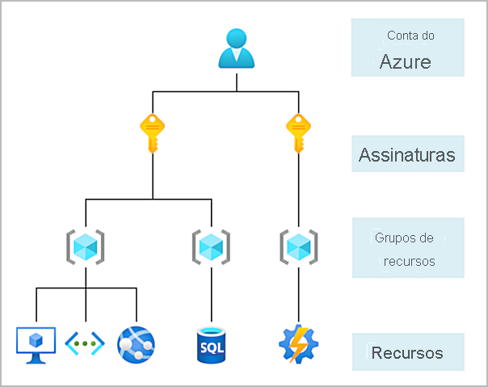
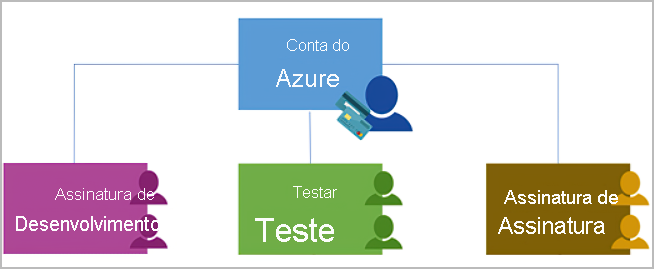
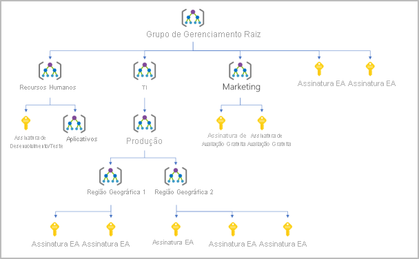

# Introdução a contas do Azure
Para criar e usar os serviços do Azure, você precisa de uma assinatura do Azure. 

## Assinaturas do Azure
No Azure, as assinaturas são uma unidade de gerenciamento, cobrança e escala. Semelhante a como os grupos de recursos são um modo de organizar logicamente os recursos, as assinaturas permitem organizar logicamente seus grupos de recursos e facilitar a cobrança.

A utilização do Azure exige uma Assinatura do Azure. Uma assinatura fornece a você acesso autenticado e autorizado a serviços e produtos do Azure. Ela também permite que você provisione recursos. Uma assinatura do Azure se vincula a uma conta do Azure, que é uma identidade no Azure AD (Azure Active Directory) ou em um diretório no qual o Azure AD confia.

Uma conta pode ter várias assinaturas, mas só é necessário ter uma. Em uma conta com várias assinaturas, você pode usar as assinaturas para configurar diferentes modelos de cobrança e aplicar diferentes políticas de gerenciamento de acesso. Você pode usar as assinaturas do Azure para definir limites em relação a produtos, serviços e recursos do Azure. Você pode usar dois tipos de limites de assinatura:

Limite de cobrança: Esse tipo de assinatura determina como uma conta do Azure é cobrada pelo uso do Azure. Você pode criar várias assinaturas para atender a diferentes tipos de requisitos de cobrança. O Azure gera relatórios de cobrança e faturas separados para cada assinatura, para que você possa organizar e gerenciar os custos.
Limite de controle de acesso: O Azure aplica políticas de gerenciamento de acesso no nível da assinatura, e você pode criar assinaturas separadas para refletir diferentes estruturas organizacionais. Um exemplo disso é que, em um negócio, você tem diferentes departamentos aos quais aplica políticas de assinatura do Azure distintas. Esse modelo de cobrança permite gerenciar e controlar o acesso aos recursos que os usuários provisionam com assinaturas específicas.
## Grupo de gerenciamento, assinaturas e hierarquia de grupo de recursos
É possível compilar uma estrutura flexível de grupos de gerenciamento e assinaturas para organizar seus recursos em uma hierarquia para políticas unificadas e gerenciamento de acesso. O diagrama a seguir mostra um exemplo de criação de uma hierarquia de governança usando grupos de gerenciamento.

