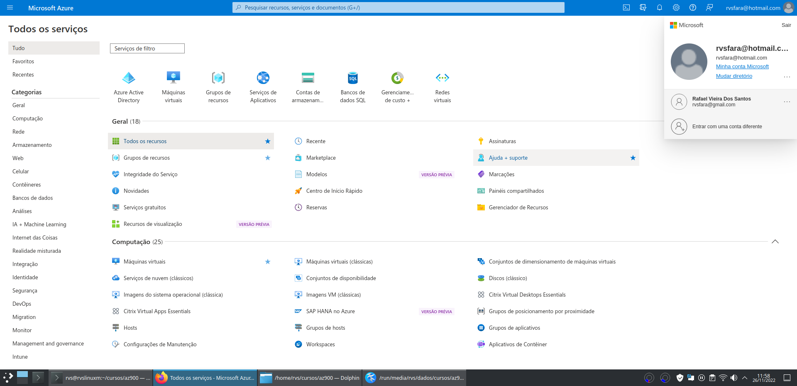
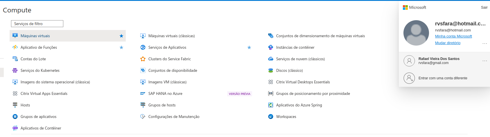
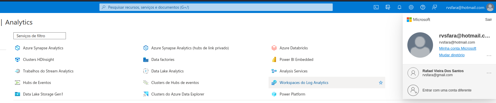
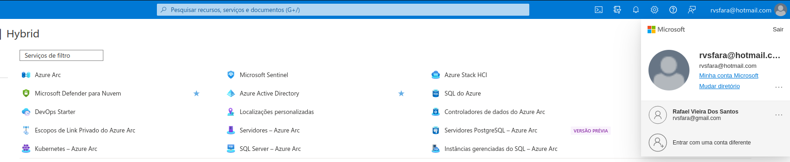

### [Voltar [Neste mesmo curso]](../README.MD)
# Painel
Principas Serviços do Azure:

## Telas do Painel
Visão Geral

Computação

Networking (Redes)

Storage (Armazenamento)

Web

Containers 

Analytics

Banco de Dados

Machine Learning (Aprendizagem de Máquina)

IoT - Internet of Things (Internet das Coisas)

Integração

Identidade

Segurança

DevOps

Migração

Monitoramento

Governança

Híbrida

Tipos de Nuvem
IaaS, PaaS, SaaS

### [Voltar [Neste mesmo curso]](../README.MD)
