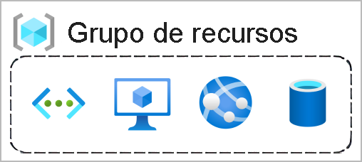

### [Voltar [Neste mesmo curso]](../README.MD)
# Infraestrura
 
Infraestrutura física
A infraestrutura física do Azure começa com datacenters. Conceitualmente, os datacenters são iguais aos grandes datacenters corporativos. São instalações com recursos organizados em racks com energia, refrigeração e infraestrutura de rede dedicadas.

Como um provedor de nuvem global, o Azure tem datacenters em todo o mundo. No entanto, esses datacenters individuais não estão diretamente acessíveis. Os datacenters são agrupados em Regiões do Azure ou em Zonas de Disponibilidade do Azure projetadas para ajudá-lo a obter resiliência e confiabilidade para suas cargas de trabalho críticas para os negócios.
Verificar o [site infraestrutura global](https://infrastructuremap.microsoft.com/).

Datacenter

## Regiões
Regiões
Uma região é uma área geográfica do planeta que contém pelo menos um data center, mas possivelmente vários, nas proximidades e conectado a uma rede de baixa latência. O Azure atribui e controla os recursos de modo inteligente dentro de cada região para garantir que as cargas de trabalho sejam balanceadas corretamente.
Quando você implanta um recurso no Azure, geralmente precisa escolher a região em que deseja que ele seja implantado.
## Zonas de Disponibilidade
Zonas de disponibilidade são datacenters separados fisicamente dentro de uma região do Azure. Cada zona de disponibilidade é composta de um ou mais datacenters equipados com energia, resfriamento e rede independentes. Uma zona de disponibilidade é configurada para ser um limite de isolamento. Se uma zona ficar inativa, as outras continuarão funcionando. Zonas de disponibilidade são conectadas por meio de redes de fibra óptica privadas de alta velocidade.

## Pares de regiões
A maioria das regiões do Azure é emparelhada a outra região na mesma geografia (como EUA, Europa ou Ásia) a pelo menos 300 milhas (cerca de 480 km) de distância. Essa abordagem permite a replicação de recursos em uma geografia, o que ajuda a reduzir a probabilidade de interrupções devido a eventos como desastres naturais, conflitos civis, quedas de energia ou interrupções de rede física afetarem toda uma região. Por exemplo, se uma região em um par de regiões fosse afetada por um desastre natural, os serviços fariam failover automaticamente para a outra região nesse par.

## Regiões soberanas
Além das regiões normais, o Azure também tem regiões soberanas. Regiões soberanas são instâncias do Azure isoladas da instância principal do Azure. Talvez seja necessário usar uma região soberana para fins legais ou de conformidade.
As regiões soberanas do Azure incluem:
US DoD Central, US Gov – Virgínia, US Gov Iowa, entre outros: essas regiões são instâncias lógicas e físicas do Azure isoladas da rede, destinadas a parceiros e órgãos do governo dos EUA. Esses datacenters são operados por cidadãos selecionados dos EUA e incluem certificações de conformidade adicionais.
Leste da China, Norte da China, entre outros: essas regiões estão disponíveis por meio de uma parceria exclusiva entre a Microsoft e a 21Vianet, segundo a qual a Microsoft não mantém diretamente os data centers.
## Recursos e grupos de recursos do Azure
Um recurso é o bloco de construção básico do Azure. Qualquer coisa que você criar, provisionar, implantar etc. é um recurso. VMs (máquinas virtuais), redes virtuais, bancos de dados, serviços cognitivos etc. são todos considerados recursos no Azure.

### [Voltar [Neste mesmo curso]](../README.MD)