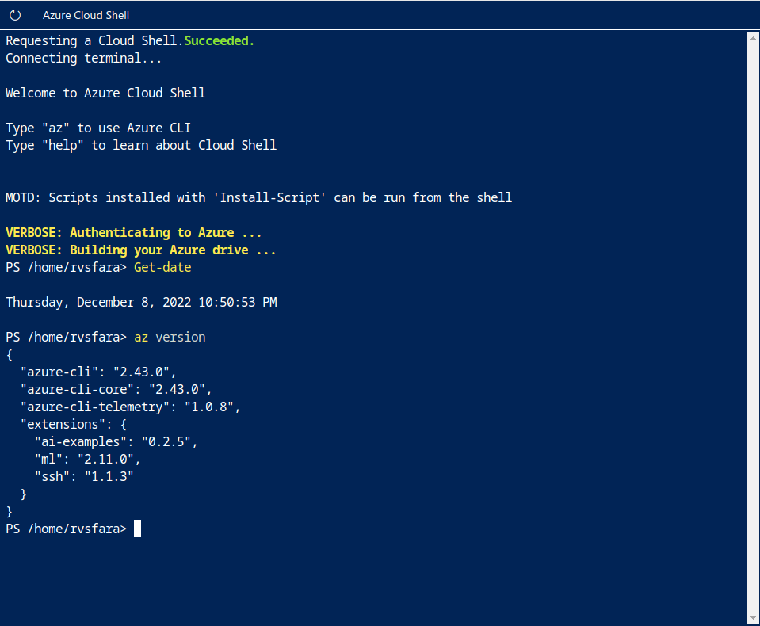
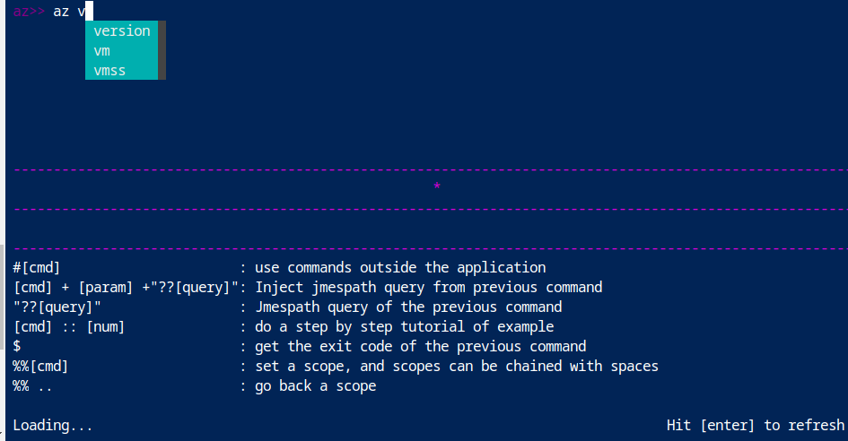

### [Voltar [Neste mesmo curso]](../README.MD)
# Area restrita do learn
### Azure Shell
Uma area de aprendizagem para o ambiente de aprendizado da Microsoft

Utilizar comandos do Bash

Modo Interativo do Azure Shell
Isso altera o comportamento da CLI para se assemelhar mais a um IDE (ambiente de desenvolvimento integrado). O modo interativo possibilita preenchimento automático, descrições de comando e até mesmo exemplos. Se você não estiver familiarizado com BASH e PowerShell, mas quiser usar a linha de comando, o modo interativo poderá ajudá-lo.

### [Voltar [Neste mesmo curso]](../README.MD)

