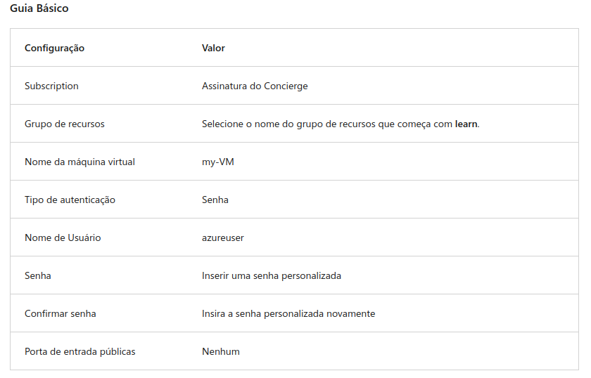
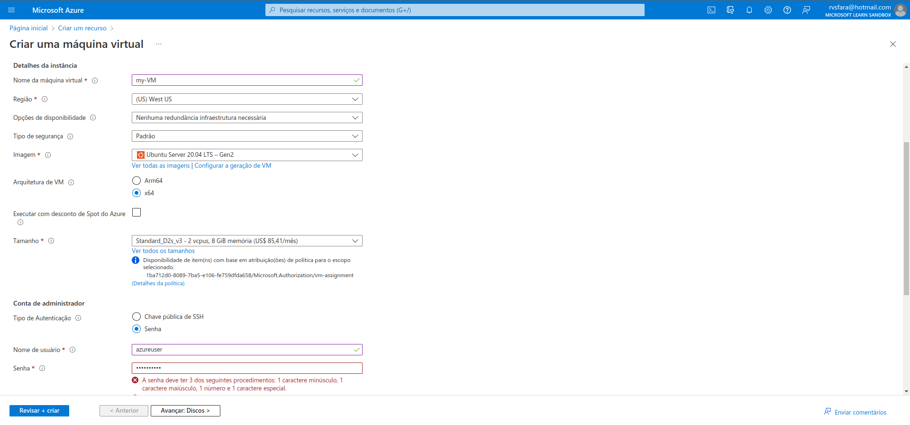
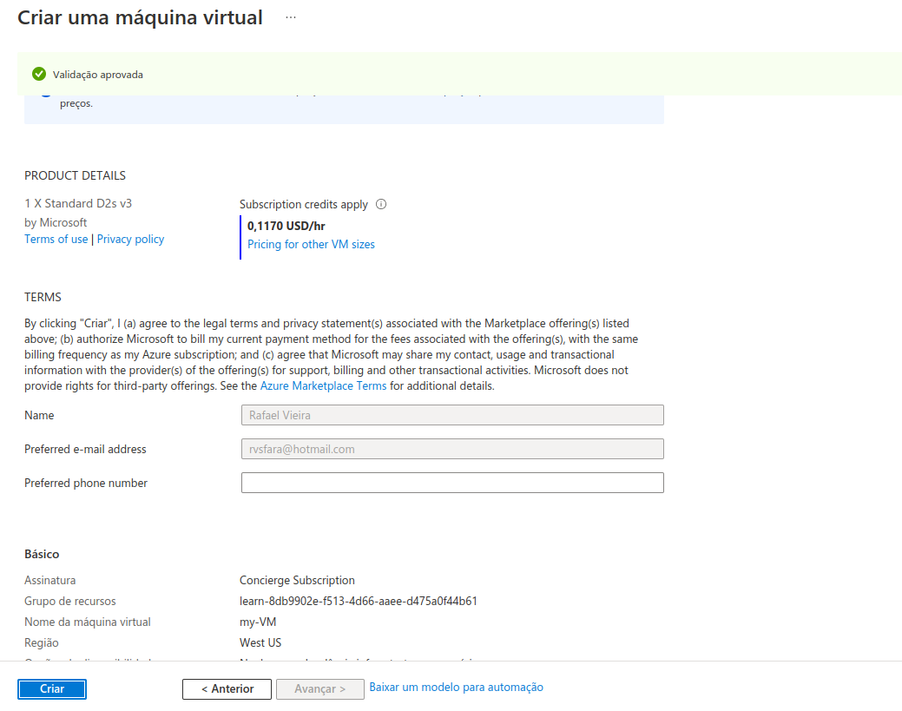
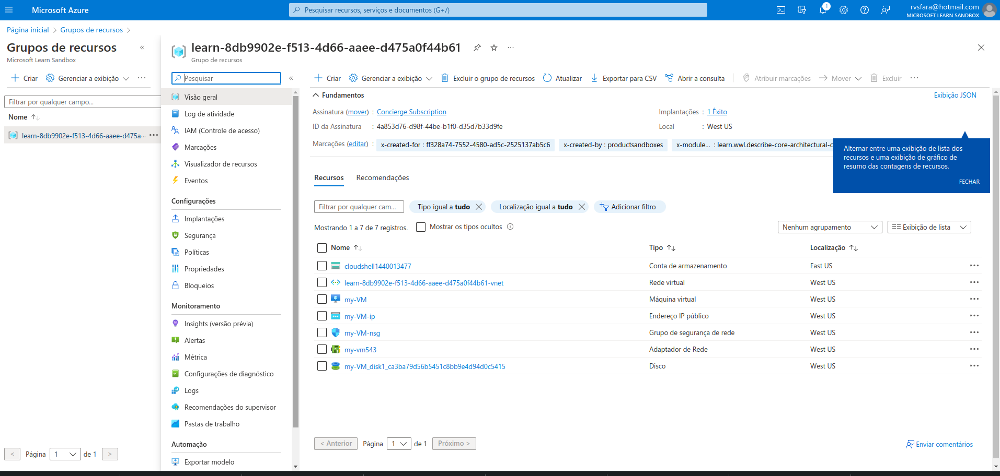
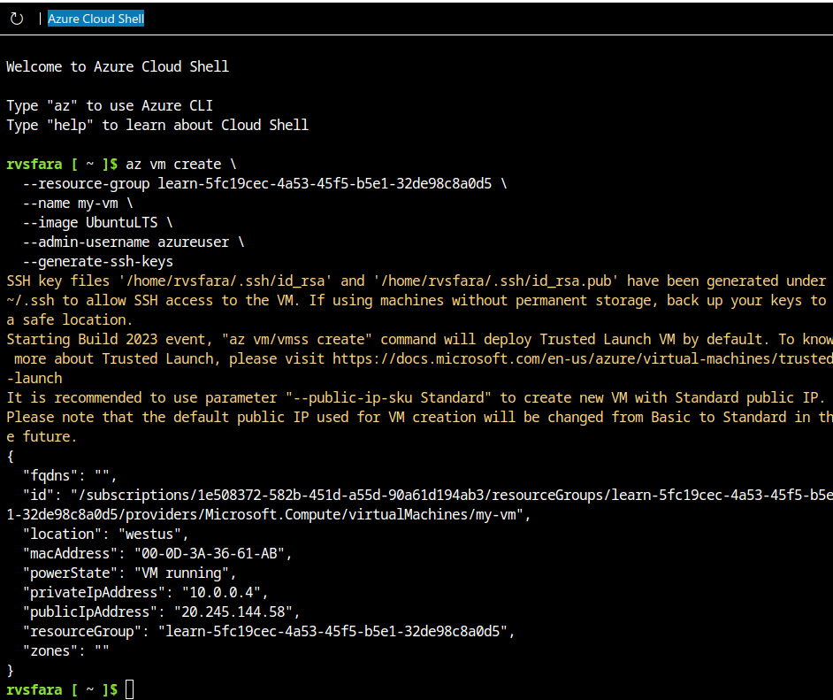
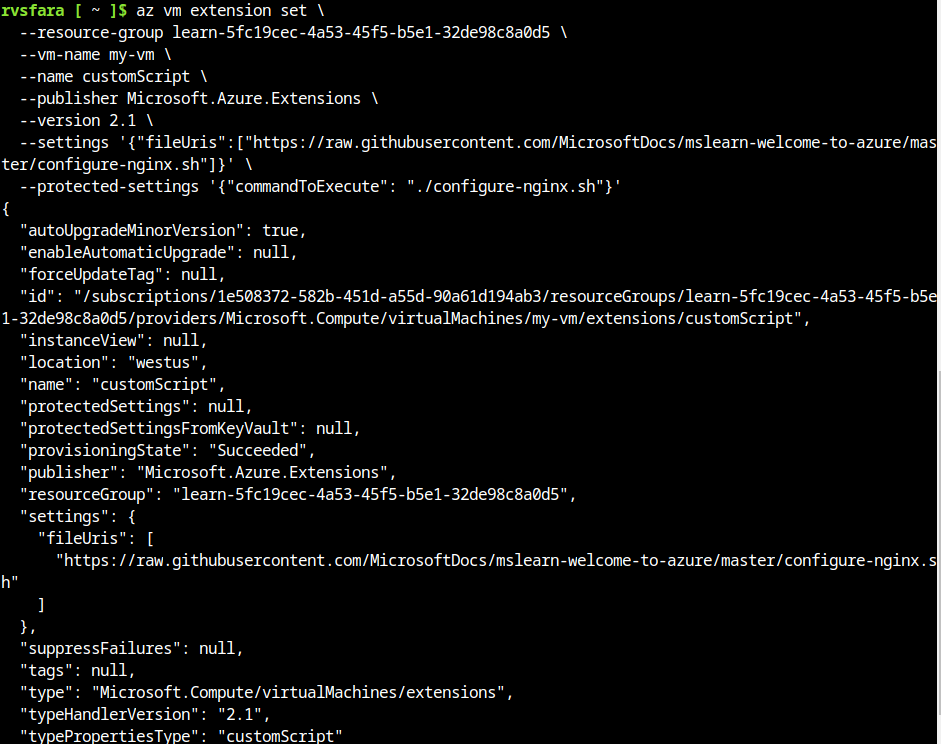
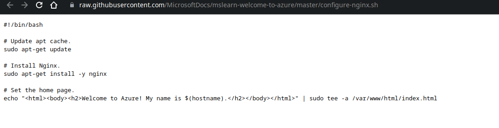

# Criar uma máquina virtual 
1. Entre no portal do Azure.

2. Selecione Criar um recurso > Computação > Máquina Virtual > Criar.

3. O painel Criar uma máquina virtual é aberto na guia noções básicas.

4. Verifique ou insira os valores a seguir para cada configuração. Se uma configuração não for especificada, deixe o valor padrão.



Dados da VM


Máquina criada


Grupos de Recursos


## Criar uma máquina Lnux e Instalar o Nginx
```sh
az vm create \
  --resource-group learn-5fc19cec-4a53-45f5-b5e1-32de98c8a0d5 \
  --name my-vm \
  --image UbuntuLTS \
  --admin-username azureuser \
  --generate-ssh-keys
```



Executa um Shell Script hospedado no github
```sh
az vm extension set \
  --resource-group learn-5fc19cec-4a53-45f5-b5e1-32de98c8a0d5 \
  --vm-name my-vm \
  --name customScript \
  --publisher Microsoft.Azure.Extensions \
  --version 2.1 \
  --settings '{"fileUris":["https://raw.githubusercontent.com/MicrosoftDocs/mslearn-welcome-to-azure/master/configure-nginx.sh"]}' \
  --protected-settings '{"commandToExecute": "./configure-nginx.sh"}'
```



Comandos para o apt instalar o nginx no ubuntu e definir o diretorio web do apache
